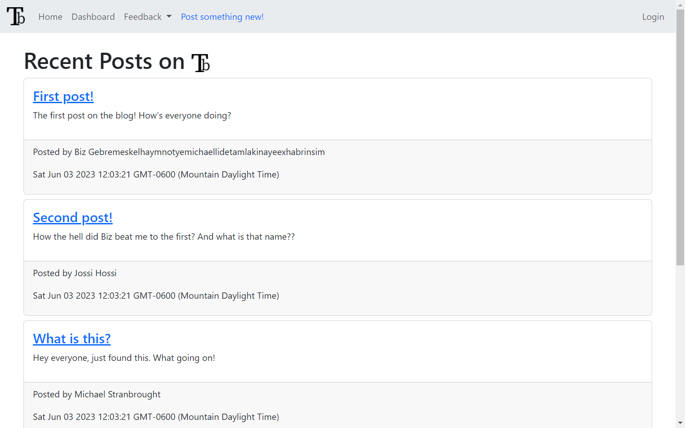

# Tech Blog
A blog website built in Express. Uses Handlebars for view and Sequelize for models and db interaction.
## Table of Contents
- [Tech Blog](#tech-blog)
  - [Table of Contents](#table-of-contents)
  - [Screenshots](#screenshots)
  - [Installation](#installation)
  - [Usage](#usage)
  - [Testing](#testing)
  - [Contributing](#contributing)
  - [Questions](#questions)
  - [License ](#license-)
___
## Screenshots

___
## Installation
Clone the repository and run the following command from the root directory:  
```bash  
npm i  
```  
This will install the nescessary dependencies.
___
## Usage
The depoyed application can be found [here](https://tech-blog-bizthehabesha.herokuapp.com/).
Alternatively, you can start a local server by running the following command from the root directory:  
```bash  
npm run start  
```  
This will start the server on your local machine.
___
## Testing
Use the insomnia test suite included in the ```/tests``` directory.
___
## Contributing
Contribute through GitHub issues
___
## Questions
Contact [BizTheHabesha](https://github.com/BizTheHabesha) on GitHub with questions or suggestions.
___
## License [](https://opensource.org/licenses/MIT)
Licensed MIT  

